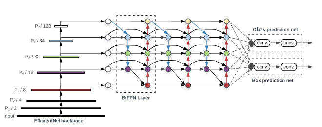

Lincoln Agri-Robotics (LAR) is the world’s first global centre of excellence in agricultural robotics, recently funded by UKRI’s Research England as part of their Expanding Excellence in England (E3) fund. This exciting centre bridges and expands the strong collaborations that exist between two leading research groups at the University of Lincoln: the Lincoln Institute for Agri-Food Technology (LIAT) and the Lincoln Centre for Autonomous Systems (L-CAS).

AgriFoRwArdS is the world's first Centre for Doctoral Training (CDT) in Agri-Food Robotics. The Centre has been established by the University of Lincoln in collaboration with the University of Cambridge and the University of East Anglia.

---
# Poinsietta Challenge

The poinsettia is a commercially important plant species of the diverse spurge family. Indigenous to Mexico and Central America, the poinsettia was first described by Europeans in 1834. It is particularly well known for its red and green foliage and is widely used in Christmas floral displays.

The Lincoln Agri-Robotics Poinsettia Challenge is a holiday-themed machine learning and computer
vision competition to devise intelligent ways to help identify features that contribute to rating the
"best" poinsettia. We will be looking at the height of the plant, colour of the leaves, and bushiness
among other attributes.

## 2nd Place Winner

---
## Find the 'bracts' challenge

The goal of the Find the bracts challenge is to find all the bracts (plant heads) in an image. This
could be used to estimate plant density, which is another criteria for grading poinsettia plants used
in nurseries.

## Solution

My solution consisted of two following stages:
1. Annotation corrections
2. Image augmentation
3. Transfer Learning

### Image augmentation

I decided to first augment the dataset of just 150 images to produce more diverse and varied frames which whould help in generalizing better. 
The various augmentation methods were as follows.

### Flip

Add horizontal or vertical flips to help your model be insensitive to subject orientation.

### 90° Rotate
Add 90-degree rotations to help your model be insensitive to camera orientation.

### Crop
Add variability to positioning and size to help your model be more resilient to subject translations and camera position.

### Rotation
Add variability to rotations to help your model be more resilient to camera roll.

### Shear
Add variability to perspective to help your model be more resilient to camera and subject pitch and yaw.

### Grayscale
Probabilistically apply grayscale to a subset of the training set.

### Hue
Randomly adjust the colors in the image.

### Saturation
Randomly adjust the vibrancy of the colors in the images.

### Brightness
Add variability to image brightness to help your model be more resilient to lighting and camera setting changes.

### Exposure
Add variability to image brightness to help your model be more resilient to lighting and camera setting changes.

### Blur
Add random Gaussian blur to help your model be more resilient to camera focus.

## Neural Network Architecture
A preliminary comparision betweenthe state of the art FasterRCNN, EfficientNet and Yolov5
was conducted. A secondary distillation of the various Yolov5 architectures was conducted.

## Training Results

## Inference Results

---

